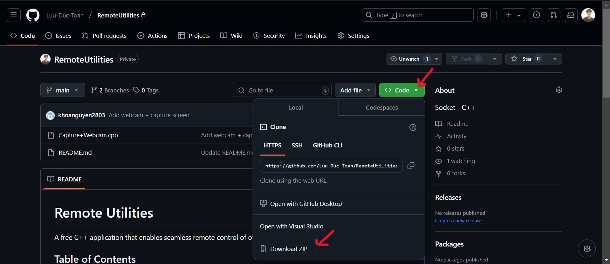
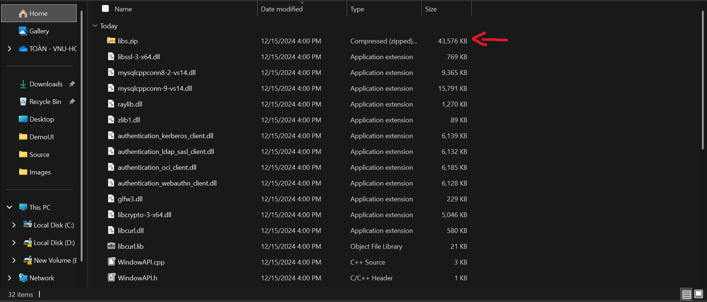

# Remote Utilities
Remote Utilities is a powerful and user-friendly remote desktop software that allows you to connect to and control window computers remotely

# Table of Contents
1. [Installation](#installation)
2. [Feature](#feature)
3. [Libraries](#libraries)
4. [Authors](#authors)

# Installation
- If you dont have **Visual Studio** yet, download [here](https://visualstudio.microsoft.com/downloads/)
- Download zip (as below image)

- Extract zip -> Extract the libraries at path: `RemoteUtilities\Source\libs.zip`

# Feature
- Socket: connect server - client
- GmailAPI: connect admin - clients
- MySQL: remote database
- WindowAPI:
  + List/Start/Stop app/service/process
  + Capture screen
  + Start/Stop webcam
  + Copy/Delete file
  + Keylogger
  + Shutdown/Reset

# Authors
- HCMUS - 23120153 - Cù Văn Nhựt
- HCMUS - 23120134 - Nguyễn Đăng Khoa
- HCMUS - 23120095 - Lưu Đức Toàn
